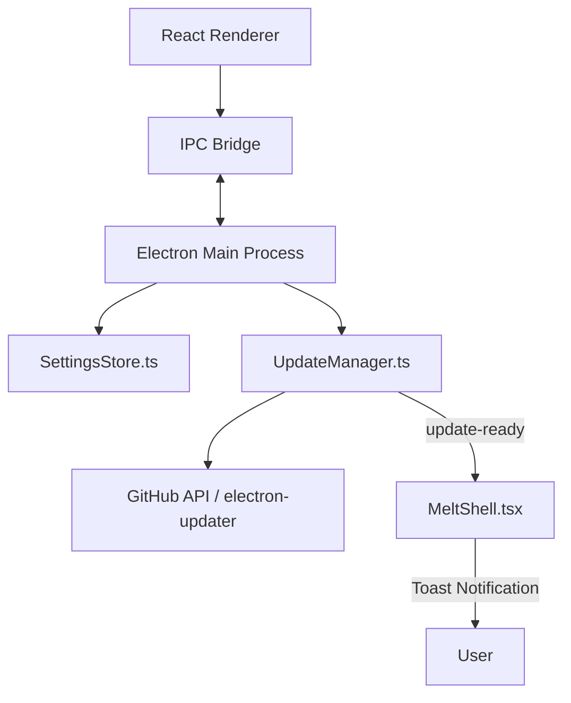

# Design: Auto-Update Solutions

## Approach 1: "Zero UX" Background Engine (Recommended)
**Philosophy**: The app manages updates silently. The user is only notified when action is required (Restart).

### Architecture


### IPC Schema
- `settings:get-all` -> Returns full config.
- `settings:set(key, val)` -> Persists to JSON.
- `update:check` -> Manual trigger.
- `update:status` (Event) -> Updates UI state.
- `update:rdy-to-restart` (Event) -> Triggers Toast.

---

## Approach 2: "User-Explicit" Manual Manager
**Philosophy**: No background downloads. The user identifies an update, clicks download, watches a progress bar, and clicks install.

### Workflow
1. App checks on start (enabled in settings).
2. If found, a "Download Update" button appears in Settings.
3. Clicking starts a foreground download with a global progress bar at the bottom of the screen.
4. Once finished, "Install & Relaunch" replaces the progress bar.

---

## Approach 3: "Lean" Manual Polling
**Philosophy**: No logic runs on startup. Updates are only checked when the user navigates to the Settings page and clicks "Check for Updates".

### Pros/Cons
- **Pros**: Zero impact on app startup performance; totally safe for low-end machines.
- **Cons**: Users may run outdated/buggy versions for long periods.

---

## Comparison Table

| Feature | Zero UX (Ap. 1) | Manual (Ap. 2) | Lean (Ap. 3) |
|---------|-----------------|----------------|--------------|
| **Startup Check** | Yes (Enabled) | Yes (Enabled) | No |
| **Download** | Background (Silent) | Foreground (Visible) | Manual |
| **Notification** | Sidebar Dot + Toast | Modal/Button | None (In Settings) |
| **Complexity** | High | Medium | Low |

## UI Mockup (Settings Component)
```typescript
{/* NEW AUTO-UPDATE SECTION */}
<div className="section">
  <Toggle label="Enable Automatic Checks" checked={config.autoCheck} />
  <Toggle label="Download in Background" checked={config.autoDownload} />
  <div className="status-readout">
    {updateStatus === 'downloading' && <ProgressBar value={progress} />}
    <span>{statusText}</span>
    {updateStatus === 'ready' && <Button label="RESTART NOW" />}
  </div>
</div>
```
