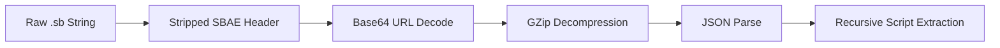

# ⚙️ SB ToolBox
**High-Fidelity Industrial Utility for Streamer.bot SBAE Management**

> [!IMPORTANT]
> This project is a technical fork of [Melty-SB-Encoder-Decoder](https://github.com/Melty1000/-Melty-SB-Encoder-Decoder), enhanced with a professional industrial design system and advanced script handling.

SB ToolBox is a specialized utility designed for technical users of [Streamer.bot](https://streamer.bot/). It provides a robust pipeline for inspecting, modifying, and re-assembling `.sb` export strings by automating the disassembly of the proprietary SBAE binary/compression format.

## 🌐 Access

Currently, SB ToolBox is accessible via the web:
� **[Open SB ToolBox (Web Version)](https://melty1000.github.io/SB-ToolBox/)**

> [!NOTE]
> Portable and installable application/executable versions (Windows/Native) are coming soon.

## �🛠️ Technical Architecture

### 1. The SBAE Protocol Pipeline
The core engine (`useSBEncoder.ts`) handles the conversion between raw `.sb` strings and editable JSON/Source metadata using a multi-stage transformation:

- **Binary Header**: Identifies valid exports via the `SBAE` byte sequence (`0x53 0x42 0x41 0x45`).
- **Compression**: Utilizes `pako` (GZip) for payload inflation/deflation.
- **Encoding**: Implements robust Base64 URL-safe sanitization to prevent truncation during IPC transfers.

### 2. Recursive Extraction Engine
SB ToolBox performs a **Deep-Scan Extraction** of all sub-actions. 
- **Type 99999 Detection**: Automates the identification of "Execute C# Code" sub-actions.
- **ByteCode Sanitization**: Decodes internal byte arrays into human-readable `.cs` source files.
- **Virtual Registry**: Maps extracted scripts to a local filesystem structure, allowing editing while maintaining referential integrity for re-encoding.

### 3. Melt Design System (MeltTypography)
The UI is built on a strict industrial aesthetic, utilizing the **Melt Design System**:
- **Zero-White Policy**: Eliminates pure white text/backgrounds to ensure high-fidelity contrast without blooming.
- **Surface Layering**: Core surfaces use `#0c0c0e` with Zinc-based semantic tokens.
- **Motion Spec**: 700ms eased transitions (`power2.inOut`) for a "heavy" mechanical feel.

## 🚀 Getting Started

To use SB ToolBox, simply access the live web version:
👉 **[Open SB ToolBox (Web Version)](https://melty1000.github.io/SB-ToolBox/)**

*Note: While the project source is available for development, the recommended way to use the utility is through the hosted pages. Native executable versions will be available soon for users requiring direct filesystem integration.*

### Tech Stack
- **Framework**: Next.js 14 (App Router)
- **Runtime**: Hybrid (Web / Electron Target)
- **Styles**: Tailwind CSS + Melt Standard
- **Editor**: Monaco Editor (Custom Industrial Theme)

## 📜 Usage Terms
This tool is intended for personal and community use in the Streamer.bot ecosystem. It facilitates script management but does not bypass the bot's inherent security or functional limitations.

---
**Developed by [Melty1000](https://github.com/Melty1000)**