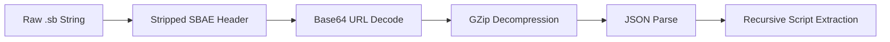

# ⚙️ SB ToolBox
**Utility for Streamer.bot Import/Export Management**

> [!IMPORTANT]
> SB ToolBox is built for Streamer.bot users who want to inspect imports, review embedded C# sub-actions, and generate import-ready payloads faster.

> [!NOTE]
> This project is a technical fork of [Melty-SB-Encoder-Decoder](https://github.com/Melty1000/-Melty-SB-Encoder-Decoder), expanded with a full UI overhaul, deeper workflow tooling, and multi-target distribution.

## 🌐 Access

- Web App: **[Open SB ToolBox](https://melty1000.github.io/SB-ToolBox/)**
- GitHub Repo: **[Melty1000/SB-ToolBox](https://github.com/Melty1000/SB-ToolBox)**
- Releases: **[Download Builds](https://github.com/Melty1000/SB-ToolBox/releases)**

## 📦 Distribution Targets

| Target | Purpose | Output |
|---|---|---|
| Installable (Windows) | Standard install flow | `SB-ToolBox-Setup-<version>.exe` |
| Portable (Windows) | Run without installer | `SB-ToolBox-Portable-<version>.exe` |
| Web App (GitHub Pages) | Browser-based use | `https://melty1000.github.io/SB-ToolBox/` |

> [!NOTE]
> Platform support is currently **Windows**. Streamer.bot compatibility target is **`1.0.4`**.

## 🧭 Core Workflows

### Decoder
- Inspect import contents before loading into Streamer.bot.
- Review extracted C# sub-actions in a full editor with CPH autocomplete support.
- Useful for creators auditing imports for unexpected code.

### Encoder
- Build systems/extensions in external editors (for example VS Code).
- Reassemble scripts + JSON into Streamer.bot-ready imports.
- Designed for AI-assisted extension workflows where manual JSON authoring is painful.

> [!WARNING]
> SB ToolBox does **not** determine whether code is safe or malicious. It exposes and reassembles content. Final trust decisions are on the user.

## 🛠️ Technical Architecture

### SBAE Pipeline


```mermaid
graph LR
    A[Raw .sb String] --> B[Stripped SBAE Header]
    B --> C[Base64 URL Decode]
    C --> D[GZip Decompression]
    D --> E[JSON Parse]
    E --> F[Recursive Script Extraction]
```

- **Binary Header**: Validates exports via `SBAE` (`0x53 0x42 0x41 0x45`).
- **Compression**: Uses `pako` (GZip) for inflate/deflate.
- **Encoding Safety**: Applies URL-safe Base64 normalization for stable IPC/file handling.

### Melt Design System

- **Zero-White Policy**: avoids harsh pure-white bloom.
- **Surface Layering**: industrial dark surfaces with semantic token mapping.
- **Motion Spec**: tuned transitions for heavy/mechanical interaction feel.

## 🚀 Build Commands

```bash
# Installable Windows package
npm run dist:installer

# Portable Windows package
npm run dist:portable

# GitHub Pages web export (staged)
npm run dist:web

# All targets
npm run dist:all
```

### Output Layout
- `release/desktop/installer/`
- `release/desktop/portable/`
- `release/desktop/checksums.sha256`
- `release/webapp/`

## ⚠️ Trust, Signing, and Transparency

- Official release artifacts produced from the maintainer build environment are code-signed.
- Local/source builds on machines without signing configuration will be unsigned, and SmartScreen prompts can occur.
- Source is public for full transparency and manual review.

## 🧪 Troubleshooting

- `spawn EPERM` during build:
  run terminal with sufficient permissions and ensure security software is not blocking spawned processes.
- Web build appears stale:
  hard refresh (`Ctrl+Shift+R`) after updating `release/webapp`.
- GitHub Pages pathing:
  project is configured for `/SB-ToolBox/`.

## 🤝 Support

[](https://discord.gg/8EfuxXgVyT)
[](https://ko-fi.com/melty1000)
[](https://www.twitch.tv/melty1000)
[](https://www.youtube.com/@melty_1000)
[](https://github.com/Melty1000)
[](https://x.com/melty1000).
- Issues: [github.com/Melty1000/SB-ToolBox/issues](https://github.com/Melty1000/SB-ToolBox/issues)

## 🤖 AI Disclosure

> [!IMPORTANT]
> Yes, I utilize AI in the creation of my projects. That does not mean I don't pour my absolute heart into them, or that I haven't lost months of sleep ensuring every release is as high-quality as possible. I work my ass off to see my dreams come true, and if my process isn't representative of what you want to support, please look toward the incredible pillars of the Streamer.bot community found in the Inspirations section below.

## 💙 Inspirations

[](https://tawmae.xyz/) [](https://doras.to/pwnyy) [](https://gaellevel.com) [](https://www.twitch.tv/web_mage) [](https://vrflad.com)

[](https://www.twitch.tv/gowman) [](https://mustachedmaniac.com/socials) [](https://nutty.gg) [](https://streamup.tips) [](https://digivybe.xyz)

## 📜 Usage Terms

Open-source intent:
- Use it.
- Modify it.
- Share it.
- Do not misrepresent authorship.

---

**Developed by [Melty1000](https://github.com/Melty1000)**
